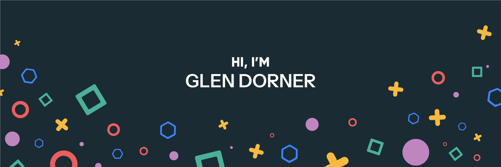

Hello!

My name is Glen, I'm a junior full-stack developer, problem solver and creative thinker. I'm all about tackling complex challenges head-on!

## 📌 Portfolio Project Repositories

 

 

 

 
 

## &#x1f4c8; GitHub Stats

 

 
 

## 💼 Main Skills

More Skills

 

 

 

